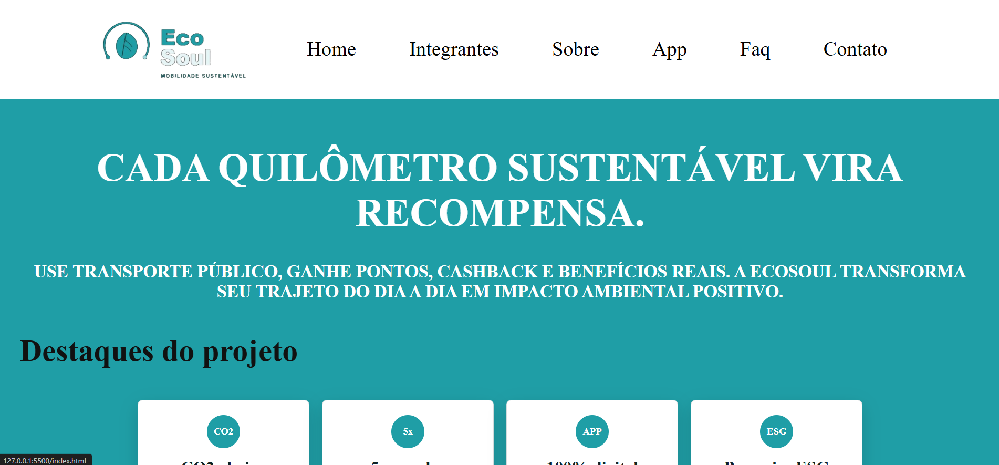
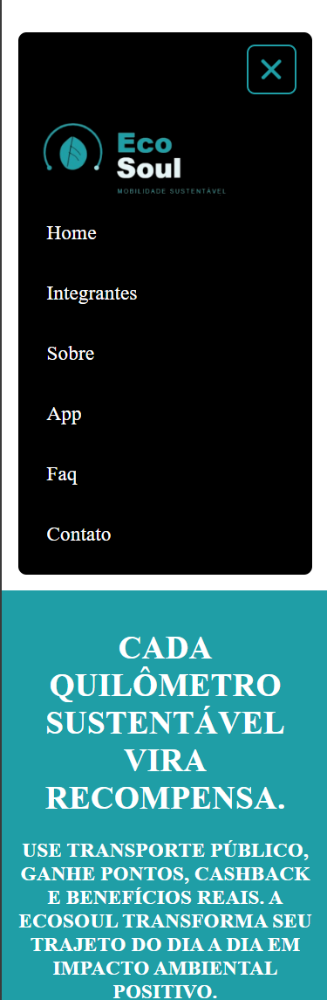
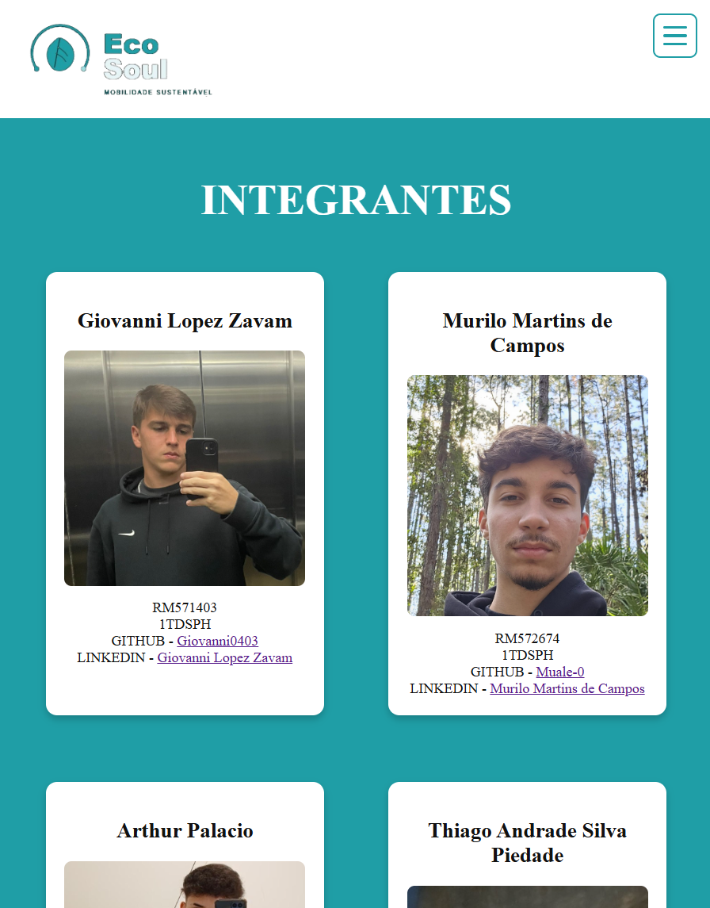
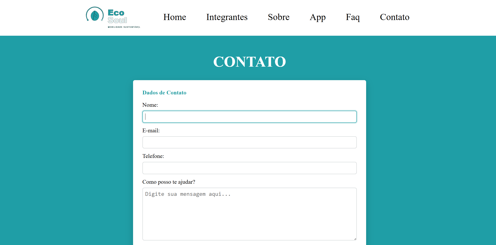

# EcoSoul - Challenge SoulUp

## Descricao do projeto

O EcoSoul e uma proposta de plataforma para incentivar o uso de transporte publico por meio de recompensas. A ideia e que o usuario utilize o app durante seus trajetos sustentaveis e, com base nos quilometros percorridos, receba pontos, beneficios e informacoes sobre o impacto ambiental positivo gerado.

O projeto foi desenvolvido para a entrega de Front-End Design Engineering, com foco em estrutura HTML, estilizacao CSS, responsividade e interacoes com JavaScript.

## Objetivo

Criar um site completo para apresentar a solucao EcoSoul, explicando o problema, a proposta, o funcionamento do app, os integrantes da equipe, perguntas frequentes e formas de contato.

## Tecnologias utilizadas

- HTML5
- CSS3
- JavaScript
- Git e GitHub

## Estrutura de pastas

css/
app.css
base.css
cabecalho.css
index.css
integrantes.css
main.css
responsive.css

img-readme/
todas as fotos de funcionamento do site

img/
logo.png
pagina_inicial.png
trajeto.png
impacto.png
perfil.png
fotos dos integrantes

js/
contato.js
interacoes.js

paginas/
app.html
contato.html
faq.html
integrante.html
sobre.html
index.html
README.md


## Paginas do site

- `index.html`: pagina inicial com apresentacao do projeto, beneficios e impacto.
- `paginas/integrante.html`: identificacao da equipe com nome, RM, foto, GitHub e LinkedIn.
- `paginas/sobre.html`: contexto do problema, proposta da solucao e diferenciais.
- `paginas/faq.html`: perguntas frequentes sobre uso, pontos, validacao e impacto ambiental.
- `paginas/contato.html`: formulario e informacoes de contato da equipe.
- `paginas/app.html`: demonstracao das telas e funcionalidades principais do app.

## Funcionalidades implementadas

- Menu principal presente em todas as paginas.
- Menu hamburguer para telas menores.
- Layout responsivo para mobile, tablet e desktop.
- Cards responsivos na pagina de integrantes.
- Formulario de contato com campos obrigatorios.
- Indicador de nivel de satisfacao com JavaScript.
- Validacao visual dos campos do formulario.
- Mascara automatica para telefone.
- Animacoes de entrada ao rolar a pagina.
- Botao para voltar ao topo.

## Responsividade

O projeto possui ajustes especificos para diferentes tamanhos de tela:

- Mobile: menu hamburguer, conteudo em coluna e campos adaptados.
- Tablet/iPad: menu hamburguer em telas menores e cards organizados em duas colunas quando necessario.
- Desktop: logo e itens do menu alinhados lado a lado, com grids mais amplos.

Os estilos responsivos estao concentrados no arquivo:

```text
css/responsive.css
```

## Integrantes

### Giovanni Lopez Zavam

- RM: 571403
- Turma: 1TDSPH
- GitHub: <https://github.com/Giovanni0403>
- LinkedIn: <https://www.linkedin.com/in/giovanni-lopez-zavam-399a04410/>

### Murilo Martins de Campos

- RM: 572674
- Turma: 1TDSPH
- GitHub: <https://github.com/Muale-0>
- LinkedIn: <https://www.linkedin.com/in/murilo-martins-de-campos-573727410>

### Arthur Palacio

- RM: 573441
- Turma: 1TDSPH
- GitHub: <https://github.com/ruhtradev10>
- LinkedIn: <https://www.linkedin.com/in/arthur-palacio-alves-3911a13b3>

### Thiago Andrade Silva Piedade

- RM: 569741
- Turma: 1TDSPH
- GitHub: <https://github.com/Euthiaguera>
- LinkedIn: <https://www.linkedin.com/in/thiago-andrade-08b2b6321/>

## Link do projeto
https://github.com/Giovanni0403/Challenge-SoulUp

## Imagens de funcionamento






## Contato
- Giovanni Lopez Zavam - rm571403@fiap.com.br
- Murilo Martins de Campos - rm572674@fiap.com.br
- Arthur Palacio - rm573441@fiap.com.br
- Thiago Andrade Silva Piedade - rm569741@fiap.com.br
